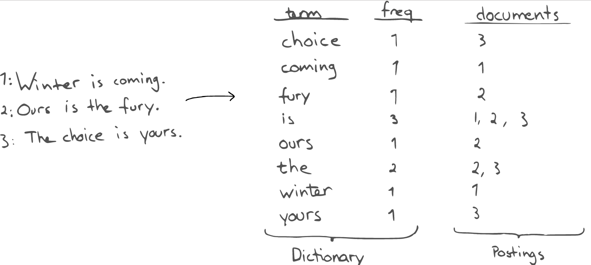
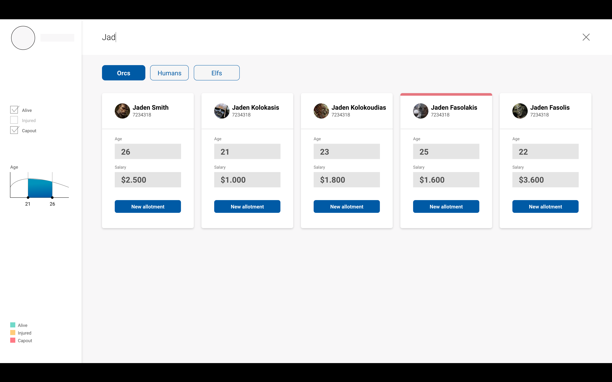
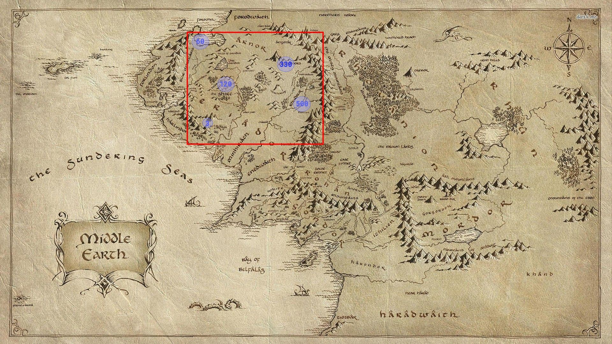
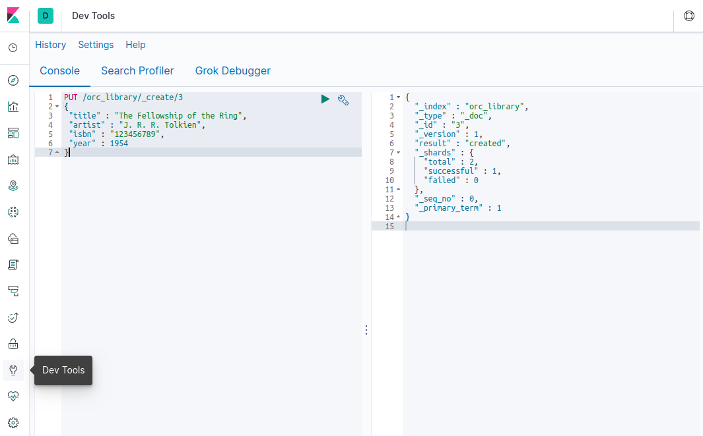
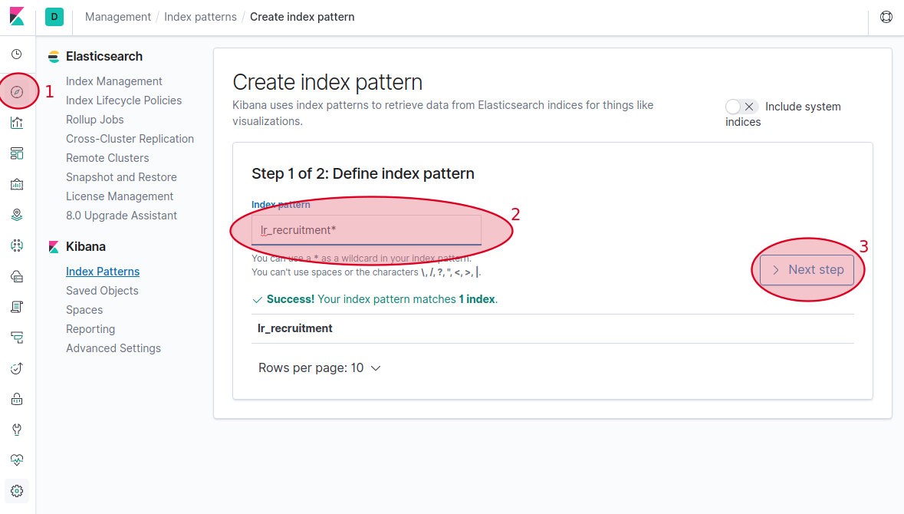
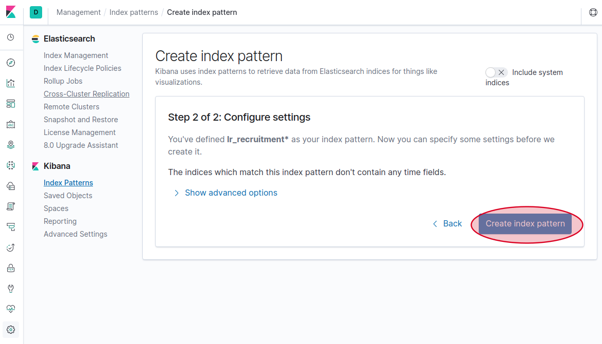
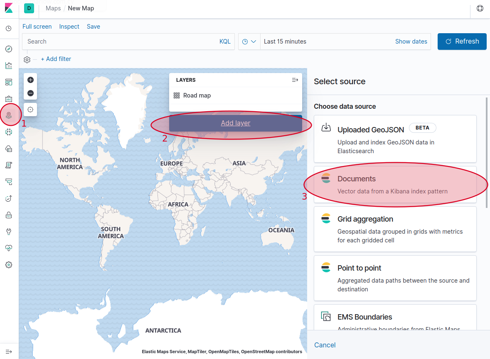
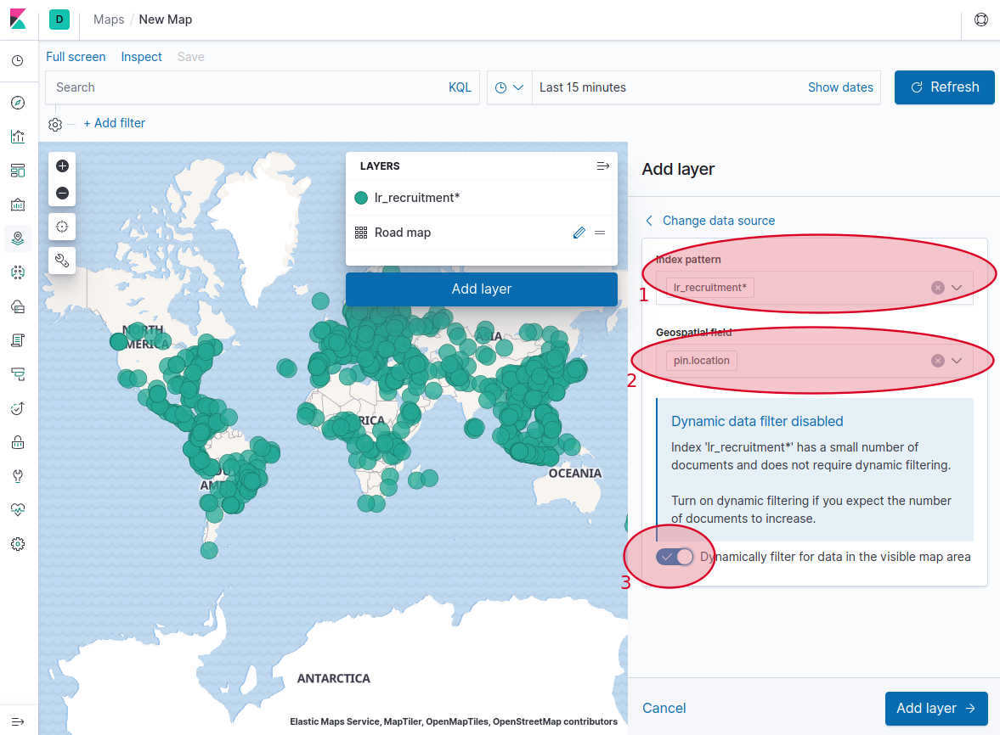
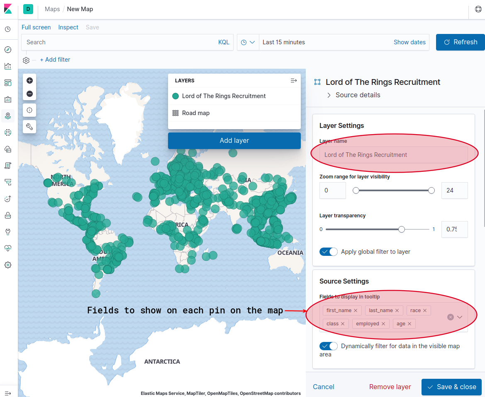

# Introduction to Elasticsearch with Kibana (Lord of the Rings Edition)

Elasticsearch is an **open source highly scalable** No Sql search engine.

It enables the analysis of large amounts of data practically in **real time**.

Elasticsearch works with JSON documents. Using an internal structure, it can parse data in real time to search for the information needed.

According to Elastic:

> Elasticsearch is a distributed, RESTful search and analytics engine capable of addressing a growing number of use cases. As the heart of the Elastic Stack, it centrally stores your data so you can **discover the expected** and **uncover the unexpected**

## Some Technical (but useful) Blah blah

Some technical (but useful) blah blah to know about Elasticsearch are:

- It is a real time distributed and analytics engine.
- It is open source, developed in Java.
- It uses unstructured documents instead of tables and schema.
- Works with inverted index 
- Used by many well known companies like: Netflix, Facebook, LinkedIn, Stackoverflow, Github etc.

Its greatest benefits are:

1. ease of use,
1. speed and
1. scalability.

- It is implemented in a way to allow querying to be really fast.
- It can be ran on your laptop or on hundreds of servers with petabytes of data.
- It has high resiliency relating to failures
- It is really flexible relating to data types

## Elasticsearch is Magic

Elasticsearch what build for searching and does an excellent job on that front. Over the years thought and due to its popularity it has evolved in many other areas like real time analytics on big data.

It can combine many types of searches on structured, unstructured, geo-location, metric, etc. In terms of analysis it allows the users to understand billions of log lines easily. It provides aggregations which helps **zoom out** to explore trends and patterns in data.

<!-- That is the Elasticsearch magic. -->

### Some simple everyday scenarios from middle earth

#### Select data within a specific range

Show all Orcs who are 21 to 26 years old from the database.


#### Search by geography

Show population in real-time while the user is zooming by aggregating Orc address with the current geographic polygon created by zooming.



#### Aggregate Orc kills by day


## Elastic Ingredients

### Cluster - 1 big bowl of Cluster

A **cluster** is like a large bowl that will hold one or more **nodes** that, together, holds the entire set of data. It provides federated indexing and search flavours across all nodes.

### Node - 2 cups of Nodes

Each cup of node (is a single server) contains several spoons of **data** poured in our bowl of **cluster**. These cups participate in the cluster’s indexing and search capabilities.

### Index - be generous on the Index

An **index** is a collection of **documents** with similar characteristics and is identified by a **name**. This name is used to refer the index while performing indexing, search, update, and delete operations against the documents in it. In a single bowl of cluster, you can pour as many indexes as you want.

### Document - a few drops of documents

Each spoon of index contains many documents with similar characteristics. Documents are expressed in JSON. A document is a basic unit of information in an index.

## Interesting Section Alert! (Hands On!!!)

## Installation

There are many ways to install Elasticsearch on a PC to play around but we live in the era of Containers so we will just run Elasticsearch and Kibana in a docker container using the two commands below. If you do not have docker installed then follow the [official documentation](https://docs.docker.com/install/) from docker to install it.

Setup Elastic Network:

```
docker network create elstacknetwork
```

Setup Elasticsearch:

```
docker run -d \
  --name elasticsearchttl \
  --net elstacknetwork \
  -p 9200:9200 -p 9300:9300 \
  -e "discovery.type=single-node" elasticsearch:7.4.1
```

Setup Kibana

```
docker run -d \
  --link elasticsearchttl:elasticsearch \
  --name kibanattl \
  --net elstacknetwork \
  -p 5601:5601 \
  kibana:7.4.1
```

## Are we there yet?

To verify if Elasticsearch is running open a web browser and go to http://127.0.0.1:9200/
You should see something like the below.

```
{
  "name" : "e8aa9aecfdba",
  "cluster_name" : "docker-cluster",
  "cluster_uuid" : "Vl3VnbgzS3-JD2bSA_dZFQ",
  "version" : {
    "number" : "7.4.1",
    "build_flavor" : "default",
    "build_type" : "docker",
    "build_hash" : "fc0eeb6e2c25915d63d871d344e3d0b45ea0ea1e",
    "build_date" : "2019-10-22T17:16:35.176724Z",
    "build_snapshot" : false,
    "lucene_version" : "8.2.0",
    "minimum_wire_compatibility_version" : "6.8.0",
    "minimum_index_compatibility_version" : "6.0.0-beta1"
  },
  "tagline" : "You Know, for Search"
}
```

If you see the above then its time to checkout the Kibana interface by visiting http://127.0.0.1:5601/ **Note** Kibana needs a few minutes to boot up the first time you install it.

If any of the above do not load then


## Lets get this party started already

In the Kibana interface, select **Dev Tools**, on the left menu. You’ll see a left console to type the commands and a right one to see the result.


#### Create Document

**PUT** command allows you to insert a new document into Elasticsearch. Type the following code in the dev tools console, press the green play button and see the result.

```
PUT /orc_library/_create/3
{
 "title" : "The Fellowship of the Ring",
 "artist" : "J. R. R. Tolkien",
 "isbn" : "123456789",
 "year" : 1954
}
```

Result should look like this:

```
{
  "_index" : "orc_library",
  "_type" : "_doc",
  "_id" : "3",
  "_version" : 1,
  "result" : "created",
  "_shards" : {
    "total" : 2,
    "successful" : 1,
    "failed" : 0
  },
  "_seq_no" : 2,
  "_primary_term" : 1
}
```

The above means the document has been created successfully.
In this example:

- orc_library - name of index
- \_create: is the create command for creating the document.
- id of element instance. In this case, is the book id. If the index orc_library did not exist already, it will be created, just as the document book and the id 3. If the document exists in the index elastic will return a conflict error like below:

```
{
  "error": {
    "root_cause": [
      {
        "type": "version_conflict_engine_exception",
        "reason": "[3]: version conflict, document already exists (current version [3])",
        "index_uuid": "s3ONGczgR0Gnvw3ejDZJKQ",
        "shard": "0",
        "index": "orc_library"
      }
    ],
    "type": "version_conflict_engine_exception",
    "reason": "[3]: version conflict, document already exists (current version [3])",
    "index_uuid": "s3ONGczgR0Gnvw3ejDZJKQ",
    "shard": "0",
    "index": "orc_library"
  },
  "status": 409
}
```

#### Update the whole Document

To update the document the process is similar to create but instead we use the **\_doc** keyword

```
PUT /orc_library/_doc/3
{
 "title" : "The Fellowship of the Ring",
 "artist" : "J. R. R. Tolkien",
 "isbn" : "123456789",
 "year" : 1954,
 "language": "English"
}
```

**Note:** The above command will **also** create a document if it does not exist

#### Get Document by ID

```
GET /orc_library/_doc/3
```

Result:

```
{
  "_index" : "orc_library",
  "_type" : "_doc",
  "_id" : "3",
  "_version" : 4,
  "_seq_no" : 3,
  "_primary_term" : 1,
  "found" : true,
  "_source" : {
    "title" : "The Fellowship of the Ring",
    "artist" : "J. R. R. Tolkien",
    "isbn" : "123456789",
    "year" : 1954,
    "language" : "English"
  }
}
```

#### Delete Document

```
DELETE /orc_library/_doc/3
```

Result:

```
{
  "_index" : "orc_library",
  "_type" : "_doc",
  "_id" : "3",
  "_version" : 5,
  "result" : "deleted",
  "_shards" : {
    "total" : 2,
    "successful" : 1,
    "failed" : 0
  },
  "_seq_no" : 4,
  "_primary_term" : 1
}
```

### Lets level up a bit

We've seen some basic commands to help us get around easily but now it is time to load some realistic Lord of the Rings Mercenary recruitment data.
You can find this in the [lr_recruitment.json](lr_recruitment.json) file.

#### Geolocation Mapping

In our sample data we have a set of coordinates (longitute, latitute) for each record. In order for elasticsearch to know that it needs to treat thesefields as coordinates we need to create a mapping for it. This is achieved by marking our location object in the document as a **geo_point**. Run the following in kibana dev tools to create the mapping:

```
PUT /lr_recruitment
  {
    "mappings": {
        "properties": {
            "pin": {
                "properties": {
                    "location": {
                        "type": "geo_point"
                    }
                }
            }
        }
    }
}
```

Result:

```
{
  "acknowledged" : true,
  "shards_acknowledged" : true,
  "index" : "lr_recruitment"
}
```

**Now** to load a data set into Elasticsearch, open a terminal console, go to the directory of the project and execute:

```
curl \
    -H 'Content-Type: application/json' \
    -XPOST 'localhost:9200/lr_recruitment/_bulk?pretty' \
    --data-binary @lr_recruitment.json
```

Lord of the Rings recruitment data should now be loaded but lets run a few queries to confirm. Go to Kibana and try some these:

Return all Orcs. `GET /lr_recruitment/_search?q=race:Orc`
Return all Orcs and Trolls. `GET /lr_recruitment/_search?q=race:Orc OR Troll`
Looking for a female Troll to hire for infiltrating into the Orcs camp to get information about their next attack? `GET /lr_recruitment/_search?q=race:Troll AND gender:Female`
Do you want that Troll to be between 20 and 45 years old? `GET /lr_recruitment/_search?q=race:Troll AND gender:Female AND age:(>=20 AND <=45)`

**Note:** URI queries above are not be the best way to query Elasticsearch. It is preferable to use [QueryDSL](https://www.elastic.co/guide/en/elasticsearch/reference/current/query-dsl.html) instead.

Elasticsearch provides a full Query DSL (Domain Specific Language) based on JSON to define queries.
There are two type of clauses in Query DSL:

- **Leaf query clauses** look for a particular value in a particular field, such as the [match](https://www.elastic.co/guide/en/elasticsearch/reference/current/query-dsl-match-query.html), [term](https://www.elastic.co/guide/en/elasticsearch/reference/current/query-dsl-term-query.html) or [range](https://www.elastic.co/guide/en/elasticsearch/reference/current/query-dsl-range-query.html) queries.
- **Compound query clauses** wrap other leaf **or** compound queries and are used to combine multiple queries in a logical fashion (such as the [bool](https://www.elastic.co/guide/en/elasticsearch/reference/current/query-dsl-bool-query.html) or [dis_max](https://www.elastic.co/guide/en/elasticsearch/reference/current/query-dsl-dis-max-query.html) query), or to alter their behaviour (such as the [constant_score](https://www.elastic.co/guide/en/elasticsearch/reference/current/query-dsl-constant-score-query.html) query).

#### Example:

```
GET /lr_recruitment/_search
{
  "query": {                                  //(1)
    "bool": {                                 //(2)
      "must": [
       { "match":{"favourite_food":"Coffee"}} //(3)
      ],
      "filter": [                             //(4)
        { "term":{"employed": false}},        //(5)
        { "range": { "age": { "gte": 25 }}}   //(6)
      ]
    }
  }
}
```

(1). The query parameter indicates query context.
(2)(3). The bool and match clauses are used in query context, which means that they are used to score how well each document matches. In this case how well the favourite food matches the word Coffee. If favourite_food is set to "Coffee" then this is a perfect match and will therefore receive a higher score than something like "Coffee cake".
(4): The filter parameter indicates filter context.
(5)(6): The term and range clauses are used in filter context. They will filter out documents which do not match, but they will not affect the score for matching documents.

#### Pagination out of the box

By default all the queries we've used so far return the top 10 results. One can specify using the `"from" : 0, "size" : 10,` command in the body of the search term from which record to show the result and how many results to include in the search. Try the below alteration and play a bit with the `from` and `size` value to understand what is happening.

```
GET /lr_recruitment/_search
{
  "from" : 0, "size" : 10,
  "query": {
    "bool": {
      "must": [
       { "match":{"favourite_food":"Coffee"}}
      ],
      "filter": [
        { "range":{"age":{"gte":25}}}
      ]
    }
  }
}
```

This was an introduction to Elasticsearch and some of its capabilities. Kibana has a lot of more features to view the data, including presenting it as different graphics. I recommend you to explore all of them.

## Presenting all our data on a map in Kibana

Earlier we created a mapping for the coordinate fields of our dataset. Now we can use our earlier work to show our data on a map in Kibana. Follow the instructions shown below in screenshots to achieve this easily:

1. First we create an index pattern like below so we can use our index data within Kibana 
1. Create the index pattern: 
1. In the next screen you will be able to see all our field indexes with their types.
1. Map Setup: Start by creating a new Document Layer. 
1. In the next screen we choose an index which automatically identifies our `pin.location` field as the **Geospatial field**. This is identified automatically due to the mapping we did earlier. 
1. Choose the filed to sho on the pins and save the layer. 

This is it! Now you have the data on the map. Try zoming in and out to see the data loading on the map and also try adding some filters to see data appearing and disappearing as you change your search criteria. For example try `race : Human` on the filter input tab on top.
